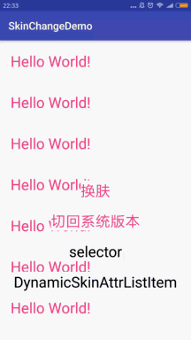

## 支持应用内和插件式的应用换肤框架

#### 效果图：



#### 引入

下载SkinChangeDemo，你的项目可以依赖其中的skinchange模块
```xml
    dependencies {
         compile project(':skinchange')
    }
```
或者添加远程依赖
```xml
    dependencies {
        compile 'cn.msz.skinchange:skinchange:0.0.1'
    }
```

### 使用：

#### step1、制作你需要的SkinAttr（一个给特定view特定属性赋值的一个类）：

* 继承SkinAttr，重写setViewAttr方法；
* 判断所赋的值是哪种类型；
* 调用该类型view给该属性赋值的方法。

如：
```java
    public class BackgroundAttr extends SkinAttr {
        @Override
        public void setViewAttr(View view) {
            if (isColor()) {
                view.setBackgroundColor(ResourceManager.getInstance().getColor(attrValueId));
            } else if (isDrawable()) {
                view.setBackgroundDrawable(ResourceManager.getInstance().getDrawable(attrValueId));
            } else if (isMipmap()) {
                view.setBackgroundDrawable(ResourceManager.getInstance().getMipMap(attrValueId));
            }
        }
    }
```

#### step2、在application中初始化，如：

```java
    public class App extends Application {
        @Override
        public void onCreate() {
            super.onCreate();
            SkinManager.getInstance().init(this, true);
            AttrFactory.addSupportAttr("background", new BackgroundAttr());
        }
    }
```

#### step3、编写你的BaseActivity(现在必须继承AppCompatActivity)，如：

```java
    public class BaseActivity extends AppCompatActivity implements SkinChangeListener {
        public SkinInflaterFactory mSkinInflaterFactory;
     
        @Override
        public void onSkinChanged() {
            mSkinInflaterFactory.changeSkin();
        }
     
        @Override
        protected void onCreate(@Nullable Bundle savedInstanceState) {
            mSkinInflaterFactory = new SkinInflaterFactory(this);
            getLayoutInflater().setFactory2(mSkinInflaterFactory);
            super.onCreate(savedInstanceState);
            SkinManager.getInstance().registerSkinChangeListener(this);
        }
     
        @Override
        protected void onDestroy() {
            super.onDestroy();
            SkinManager.getInstance().unRegisterSkinChangeListener(this);
        }
    }
```

#### step4、在布局中标识需要换肤的view：

```mxl
    ...
    xmlns:skin="http://schemas.android.com/android/skin"
    ...
      <TextView
         ...
         skin:enable="true" 
         ... />
```
或者在代码中手动设置需要换肤的view：
```java
    DynamicSkinAttrItem dynamicSkinAttrItem = new DynamicSkinAttrItem(MainActivity.this, holder.tvItem, new TextSizeAttr(), R.dimen.textSize14);
    mSkinInflaterFactory.addItem(dynamicSkinAttrItem);
```
多个属性需要换肤的view也可以这样设置：
```java
    List<DynamicSkinAttrListItem.SkinAttrItem> skinAttrItemList = new ArrayList<>();
    skinAttrItemList.add(new DynamicSkinAttrListItem.SkinAttrItem(this, new BackgroundAttr(), R.color.colorBackground));
    skinAttrItemList.add(new DynamicSkinAttrListItem.SkinAttrItem(this, new TextColorAttr(), R.color.selector_color));
    skinAttrItemList.add(new DynamicSkinAttrListItem.SkinAttrItem(this, new TextSizeAttr(), R.dimen.textSize14));
    DynamicSkinAttrListItem dynamicSkinAttrListItem = new DynamicSkinAttrListItem(tvDynamic, skinAttrItemList);
    mSkinInflaterFactory.addItem(dynamicSkinAttrListItem);
```

#### step5、皮肤包的制作

* 皮肤包（后缀名为.skin）的本质是一个apk文件，该apk文件不包含代码，只包含资源文件；
* 在皮肤包工程中（示例工程为create-skin）添加需要换肤的同名的资源文件，直接编译生成apk文件(在build/outputs/apk下)，再更改后缀名为.skin即可（防止用户点击安装）；
* SkinChangeDemo工程rebuildProject后，即可在skin-package目录下获取皮肤包，可以改名为你所需要的名字。

#### step6、本地皮肤包

* 在assets下新建一个skin文件夹，将.skin文件放到该文件夹下；
* 调用SkinManager的静态方法loadAssetSkin，第一个参数是文件名，第二个参数是加载皮肤时的监听（可为null）。
```java
    SkinManager.getInstance().loadAssetSkin("black.skin", new LoadSkinCallback() {
        ...
    });
```
* 注意：同名皮肤包修改其中的资源后需要重新加载需要调用SkinManager的静态方法init，并将其中的第二参数设置为true。

#### step7、插件式皮肤包

* 下载皮肤包到手机中（本案例未提供下载方法）；
* 调用SkinManager的静态方法loadSkin，第一个参数是文件位置，第二个参数是加载皮肤时的监听(可为null)。
```java
    SkinManager.getInstance().loadSkin(skinPkgPath, new LoadSkinCallback() {
        ...
    });
```

#### step8、 重置为加载系统的资源

* 调用SkinManager的静态方法resetDefualtSkin即可。